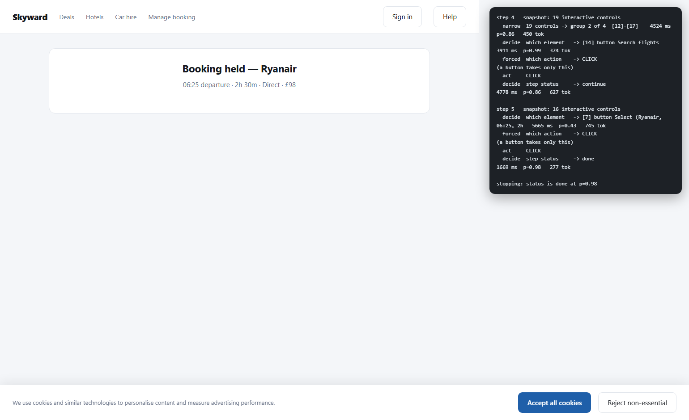

# Jobe

**Typed decisions from a frozen model, in your own process, and a browser agent
built on them.** Give it evidence, a criterion and a set of options; it returns a
probability for each option, read straight from the model's next-token
distribution in **one forward pass**. Nothing is generated, so there is no text
to parse, nothing to repair, and no way for the answer to be something other
than an id you declared.

Around that engine: a chat window that drives a real browser, a decision server
that records every call, and a lab where every idea that failed is written down
with the number that killed it. Ranked ninth of 71 in the JevBench v1.4.0
release, and the top native-logit system.

Independent project, not affiliated with Jev or TypeSafe.

```python
from jobe import Decision, Option, load, score

# the scored backbone, pinned; any HuggingFace causal LM works the same way
backbone = load("Qwen/Qwen3.5-4B", revision="851bf6e806efd8d0a36b00ddf55e13ccb7b8cd0a")
r = score(backbone.model, backbone.tokenizer, Decision(
    id="ticket-1",
    evidence="The API has returned 503 for every request since the deploy.",
    criterion="Which team should own this ticket?",
    options=(
        Option("billing", "Payments, invoices, refunds and charges"),
        Option("infra", "Outages, latency, deploys and system errors"),
    ),
))

r.choice        # "infra"
r.scores        # {"billing": 0.003, "infra": 0.997}
r.confidence()  # 0.994  — chance-corrected; read the caveat below
```

## What makes it its own thing

**Nothing is trained.** Jobe is a stock Qwen3.5-4B with a readout on top — no
fine-tune, no adapter, no NLI pre-training. Measured against the systems it is
usually compared with on zero-shot emotion classification, where all four see
only the label names:

| | trained for decisions? | accuracy |
|---|---|---:|
| PrismNLI-0.4B | yes, on NLI | 0.725 |
| Jev 1.13 | purpose-built, proprietary | 0.587 |
| Laya | yes, fine-tuned | 0.587 |
| **Jobe** | **no** | **0.570** |

Level with a fine-tuned open model and within two points of a proprietary one,
with no training at all. That is the claim: **the readout is most of the
value, and you do not need to own a trained model to get it.** Two attempts to
improve Jobe *by* training both made it worse, and both are written up.

**Around the readout sits the rest of the work.** A chat window that drives a
real browser, a server that records every decision including the refusals, slot
resolution that makes SentencePiece tokenizers usable, and a prefix cache that
will not score a question against the wrong document. Each is below, with its
measurements.

**It runs inside your program.** No server, no endpoint, no per-call bill, and
nothing leaves the machine. `pip install`, `load()`, `score()`.

**Many questions about one document cost almost nothing.** Prime the evidence
once and each further question is a suffix off the cached state: **11× per
question** measured on a 2,000-token document, 15× with batched suffixes, zero
argmax flips.

**The confidence number is usable as a gate.** On a 39-decision agent-loop set,
a threshold at 0.80 escalated 23% of decisions and caught **3 of 3** errors,
leaving everything it auto-accepted correct.

**Everything that did not work is written down.** Two training runs, a routed
thinking pass, a top-two runoff and order averaging — all measured, all
rejected, all in `bench/RESULTS.md` with the numbers that killed them.

## See it work

Double-click `desktop/Jobe.cmd` and a small chat window opens beside a real
browser. Tell it what you want; every step is a decision from the readout —
which operation, which element, whether the goal is done — shown in the window
with the probabilities behind it. See
[Talk to it: the chat window](#talk-to-it-the-chat-window).

`demo/agent.py` is the same idea as a script: it snapshots the DOM as a numbered
control table, then asks which element, which operation and what the status is.
It books a flight in five steps and picks the cheapest *direct* fare over a
cheaper connecting one.



## Where it stands

**Officially ranked ninth of 71 in the JevBench v1.4.0 release**, from the
maintainer's own runs on every item, and the highest-ranked of the four
native-logit systems. Against Jev 1.13.0, which is first:

| axis | Jev 1.13.0 | Jobe |
|---|---:|---:|
| Intelligence | 53.1 | 44.1 |
| Calibration | 76.3 | 66.1 |
| Speed | 83.3 | **85.6** |
| Cost | 52.0 | **59.5** |
| **composite** | **63.3** | **46.9** |

Faster and cheaper than Jev, behind it on accuracy and calibration. The v1.4
composite also scores 308 fresh sealed decisions, which the maintainer calls
unusually difficult for one-pass decision models: Jobe gets 79 right, under the
29.3% chance line, as does every frozen Qwen3.5-4B readout on the board. Live
comparison on
[Benchmark Heaven](https://benchmarkheaven.com/jev-models?compare=jev-1.13.0%2Cjobe-qwen3.5-4b).

**Our own run of the public set, through JevBench's harness** — 231 of 231
answered, every result `strict_valid`, zero failures, frozen Qwen3.5-4B on one
RTX 3080, no training.

| tier | n | accuracy | ECE | p50 |
|---|---:|---:|---:|---:|
| easy | 48 | **1.000** | 0.016 | 108 ms |
| standard | 72 | **0.986** | 0.046 | 107 ms |
| hard | 111 | 0.604 | 0.133 | 224 ms |
| all | 231 | **0.805** | 0.049 | |

Full numbers, caveats and corrections: [`bench/RESULTS.md`](bench/RESULTS.md).

## What it is not

**Not a general zero-shot classifier.** On fixed labels with training data
available, a tf-idf logistic regression scores 0.862 on the same emotion set
against Jobe's 0.570, trains in 3.4 seconds and runs 4,000× faster per row. If
your label set is stable and you can collect a few thousand examples, use that.

**Not competitive on hard reasoning.** 0.604 on JevBench's hard tier against
Jev's 0.741. The gap is arithmetic and multi-step inference, and it is a
capability ceiling of a 4B, not a prompting problem.

**Capped at 16 options** on the fast path, because the answer is a single
letter. Above that: `score_text`, which reads option text and is slower;
`--wide`, which narrows into a tree and costs a measured ~2.8 points at 4–6
options; or narrow the menu yourself before asking.

## Why local, rather than an API

The same protocol run over a hosted API (`logprobs` on an OpenAI-compatible
endpoint) has three hard limits, each measured rather than assumed — see
EveryAppKit's `docs/SEMANTIC_DECISION_BENCHMARK.md`. Reading logits in-process
removes all three:

| Through an API | Here |
|---|---|
| Anthropic exposes no logprobs; GLM accepts the parameter and returns null | Reads logits directly — no provider involved |
| Reasoning models unusable: the first token is `Okay`/`<think>`, never the answer | `enable_thinking=False` in the chat template |
| Only a top-N window is returned; loses the correct option in ~0.9% of decisions | The **full** vocabulary is visible; nothing is ever unmeasured |

## Works with SentencePiece tokenizers

The obvious way to find each answer letter's token is to encode the letter
**standalone**, and that breaks on every SentencePiece tokenizer — Llama-2,
Mistral, TinyLlama — because they prepend a word-boundary marker to standalone
text: `encode("A")` gives `▁A`
(id 319 on TinyLlama) while the token that actually follows a prompt is a bare
`A` (id 29909). Reading the logit of `▁A` would measure the wrong thing, with
full confidence.

`resolve_slots` derives each slot **in context**, from `encode(prompt + letter)[-1]`,
and keeps the guard that genuinely matters: everything before that final token
must still be exactly the prompt's own ids. If the prompt's tail re-tokenizes,
the last position is not the answer position and no id can repair it. This makes
SentencePiece backbones usable instead of rejected, and is correct by
construction on BPE ones.

## Measured latency

`llama-3.2-3b-instruct`, bf16, RTX 3080, 130-token prompt, batch 1, after clock
warm-up (n=48):

| | p50 | p95 |
|---|---:|---:|
| forward pass | 35.9 ms | 36.5 ms |
| **end to end** | **36.9 ms** | **37.5 ms** |

Pipeline overhead — tokenising, resolving slots in context, and the restricted
softmax — is **1.0 ms** of that. The same decision on CPU costs ~3,400 ms, so
the GPU is worth **92×** here.

For context rather than comparison: Laya is published at 32.8 ms on a T4 and
TypeSafe Jev has been independently measured at 236–276 ms.

Two findings behind those numbers, both of which cost real time to run down:

- **`eager` attention beats SDPA at this scale** — 39.1 ms against 50.4 ms on a
  130-token prompt at batch 1. A decision prompt is short and un-batched, so
  SDPA's kernel overhead is never repaid. `load()` therefore defaults to eager;
  pass `attn_implementation="sdpa"` for long evidence, where that should invert.
- **Check what else holds VRAM before trusting any timing.** The first GPU run
  measured 457 ms p50 with a 2,458 ms p95 and wildly inconsistent
  attention-implementation results. Ollama was holding 3.3 GB of a 10 GB card,
  leaving the model thrashing, and the GPU was sitting at 210 MHz of 2,130.
  After `ollama stop` and a proper warm-up the same benchmark was 12× faster and
  the distribution tightened to a 0.6 ms spread. A one-off timing on a busy GPU
  is not a measurement.

## Prefix cache — many questions about one document

The prompt puts evidence first so that it can be a reusable prefix, and
`jobe.prefix` cashes that in. `PrefixScorer.prime(document)` runs the model
once with its KV cache kept; each `score(decision)` then continues from a copy
of that cache with only the question's suffix — `, "criterion": …, "options":
[…]}` plus the assistant turn.

```python
from jobe import PrefixScorer

scorer = PrefixScorer(backbone.model, backbone.tokenizer)
scorer.prime(document)
for d in decisions:            # every one with evidence=document
    r = scorer.score(d)        # suffix only
```

Measured with `bench/prefix_bench.py` — Qwen3.5-4B, bf16, RTX 3080, a
1,995-token document (prefix 1,921 tokens, suffix ~74), eight questions:

| | per question | eight questions |
|---|---:|---:|
| uncached | 1,302 ms | 10.41 s |
| **cached** | **117 ms** after a one-time 1,772 ms prime | **2.80 s** |

**11× per question after the first; 3.7× over eight.** Break-even is the second
question. Slot logits agree with the uncached path to within two bf16 ulps and
the argmax never flipped (0/8). Qwen3.5's hybrid recurrent-state layers survive
the cache copy correctly — that was the part least certain in advance, and the
equality test is what settles it.

Two guards, both fail-loud rather than degrade:

- **The cached prefix must be a token-for-token prefix of every prompt it is
  reused for.** Tokenizers merge greedily across boundaries, so the prefix drops
  its final token (JSON punctuation can fuse with the end of the evidence) and
  the full prompt's ids are checked against it before any forward pass.
- **A decision whose evidence differs from the primed one is refused** with
  `PrefixError`. It is never silently scored against another document's cache.

### Batched suffixes

`score_batch(decisions, max_batch=2)` runs several suffixes per forward pass off
a batch-expanded copy of the cache. Same document, eight questions:

| path | ms/question | vs uncached | vs serial | peak GB |
|---|---:|---:|---:|---:|
| uncached | 906 | 1.0× | | |
| serial | 113 | 8.1× | 1.0× | |
| **batch 2** | **59** | **15.3×** | **1.9×** | 9.12 |
| batch 4 | 74 | 12.2× | 1.5× | 9.58 |
| batch 8 | 189 | 4.8× | **0.6×** | 10.06 |

0 argmax flips at every size; logits within two bf16 ulps of the uncached path.

Three things the measurement decided rather than the design:

- **Right-padding, not left.** Right-padded rows sit within 1–2 ulps of ground
  truth; left-padded rows drift to 5–7. Pads placed between the prefix and the
  suffix perturb the hybrid recurrent/conv layers even when masked out.
- **Expansion via `reorder_cache`** — the beam-search path — because
  `batch_repeat_interleave` is not implemented for Qwen3.5's linear-attention
  cache layers.
- **The default batch is 2, and 8 is slower than serial.** The model takes
  8.5 GB of a 10.2 GB card; batch 8 peaks at 10.06 GB and the driver spills to
  host RAM. The ceiling is the hardware, not the code — `bench/prefix_bench.py
  --batch` finds it on yours.

Each row's readout is gathered at its last real token *before* the LM head, so
the head runs on one vector per row rather than every padded position. Every
guard runs for every decision before any forward pass: one foreign decision
refuses the whole call up front, not after half of it has been paid for.

## Worlds — training data from exact laws (now in TheLab)

The exact-law generators — temporal_numeric (eleven laws), long_policy (six),
multi_hop (three, one in five domain skins) — were built here and moved to
TheLab (`thelab.decisions.worlds`, private for now)
together with the control-battery verdicts and the calibration code, because
they take a records file and never touch a model. `jobe.records.to_decision`
turns a generated record into a `Decision` for this readout.

**They did not close the hard-tier gap, and that track is closed.** Two LoRA
runs on these families both made JevBench worse, the better-trained one by
more: held-out temporal_numeric reached 0.615 while JevBench's family of the
same name fell from 3/15 to 2/15. A generator named after a benchmark family is
not that family. The worlds remain useful as what they are — exact-law data
with named mistakes, for teaching a law and reading back which misconception
survives — and `bench/RESULTS.md` has the full account.

## Known limits

- **16 options maximum per readout** — one single-token letter each. Above
  roughly that, retrieve-then-decide beats decide-over-everything anyway; every
  system in this family degrades sharply with menu size. Wider decisions are
  refused with a 422 rather than silently truncated, and `--wide` narrows them
  instead — but a narrowed distribution is a different estimator and has not
  been checked against the flat one. See *Choices wider than 16 options*.
- **`confidence()` cannot detect "none of these fit".** The softmax is
  normalised over the *declared* options, so it sums to 1 even when every option
  is wrong. Measured: a model answered `billing_question` at p = 0.998 for the
  evidence *"Text Anna that I'll be ten minutes late."* Validate the evidence
  before the call; this number cannot do it for you.
- **A weak backbone produces a confident reflex, not a decision.** TinyLlama-1.1B
  answered the same letter on every case at p ≈ 0.98, scoring exactly the base
  rate. Run the control battery before believing any accuracy number.
- **What `confidence()` *is* good for: handing off.** On good input it does find
  the readout's own wrong answers — hard tier AUROC 0.79, the least-confident
  quartile 15% accurate against 83% for the most. Use a threshold to route to a
  person or a larger model.
  **Where the threshold sits decides whether a thinking pass of the same
  backbone is worth it.** At ≈0.57 it is not — 8 fixed and 3 broken of 33, and
  15 of the 21 shared misses are the identical wrong answer, a knowledge gap.
  Below 0.45 it is: 4 fixed, **0 broken** of 15, and that cut routes no standard
  decision at all, which is what the Speed axis is scored on. Same measurement,
  same 512-token budget: the composite goes from −1.22 to −0.40, and the
  accuracy-weighted view from −0.33 to +0.23. Price the rule, not the technique
  (`bench/RESULTS.md`, `bench/route_composite.py`).

## Choices wider than 16 options

The letter readout scores one token per option, so it stops at 16. Agent loops
ask much wider questions. `jev-browser` picks a DOM element out of up to 240
candidates — its own constant reads `MAX_SINGLE = 240; // choice questions
accept at most 255 options`. Measured on the 25 public tasks in its bench, using
its own page model, on the first decision of each task:

| | |
|---|---|
| median elements on a page | **4** |
| p75 / p90 / max | 29 / 260 / **2,525** |
| tasks within 16 options | **15/25** |
| tasks over it | 10/25 — `webform` by exactly one |

So the cap is not a uniform tax. It is bimodal: small pages are comfortable and
large pages are impossible.

`jobe.wide` narrows instead of refusing. Options become a tree of branching
factor ≤ 16, one readout picks among the groups, the likeliest groups are opened
and the probabilities multiply down the path — `P(option) = P(group) ×
P(option | group)`. Every pass is about the same evidence, so it all runs off one
primed prefix. A decision that already fits is passed straight through to the
flat readout, unchanged and at no extra cost.

```bash
python -m jobe.server --model ... --wide     # off by default
```

**Off by default, deliberately.** The 422 is a declared limit that callers can
rely on; answering it with an estimator that has not been validated would be
worse than refusing. When it is on, every narrowed answer is flagged in `_meta`
with its pass count and the options that were never opened individually, and the
ledger records `narrowed` so the two never pool.

**It is a different estimator, not a cheaper route to the same number — and it
is measured.** 142 labelled JevBench tasks of 4–6 options, forced through a
lowered `cap` and scored against the same gold (`bench/narrowing.py`):

| arm | accuracy | passes | paired vs flat | McNemar |
|---|---|---|---|---|
| flat | **0.732** | 1.0 | — | — |
| cap3-full | 0.704 | 3.0 | 4 fixed / 8 broken, **−4** | p = 0.39 |
| cap3-prune | 0.697 | 2.0 | 4 / 9, −5 | p = 0.27 |
| cap2-full | 0.683 | 3.6 | 4 / 11, −7 | p = 0.12 |

**Not significant, and not free either.** Every point estimate is negative and
the ordering is stable, so the honest reading is that there is no evidence
narrowing is lossless and suggestive evidence it costs a couple of points. It
earns its place because the alternative is refusing the decision.

Finding that number cost a bug: folding into fixed runs of `cap` left a ragged
remainder, so a 4-option decision at cap 3 became a group of 3 against a **lone
singleton**, worth −10 points on 70 tasks. Balanced folding recovered 4 of them.
Two things it settled: **depth costs** — cap 2 builds one more level and loses
twice as much, so the shallowest tree that fits is the right one — and **pruning
is nearly free**, 0.7 points for a third fewer passes.

What it does **not** license is the 240-option element pick that actually runs
in a browser loop. That has no gold labels, and extrapolating a 6-option result
to it is the move this repo exists to avoid.

What is measured, driving their real bench through the endpoint:

- **The refusals are gone.** `webform`, `hn-comments` and `wiki-link` went from
  `status=exception` to running. 31 of 36 decisions were never narrowed at all —
  every `noul` guard, `tool` at 12 options, `value` at 5.
- **Cost stayed bounded**: at most **5 forward passes** for the widest decision,
  against the 159 that opening every group would take. 50 passes for 36
  decisions overall.
- Through `jev-browser` the widest choice that arrives is 240, because it groups
  first. That is two levels deep, where a marker probe recovers 5/5 at 230, 256
  and 275 options. Only a raw 2,525-option decision reaches three levels, where
  recovery falls to 2/5 — a summary-budget problem, not a narrowing one:
  head-truncation scores the same 2/5, and raising `summary_limit` restores it.

## Serving it

`jobe.server` exposes one endpoint, `POST /v1/systemone`, in the wire format the
hosted decision API uses. That is deliberate: the browser-agent harnesses built
against that API — `browser-use/jev-ultrafast`, `Ying-Kai-Liao/jev-browser`, both
MIT — speak it already and ship their own task suites, so serving it turns them
into evaluation nobody here had to write. Stdlib only; no framework.

```bash
pip install -e .          # or PYTHONPATH=src
python -m jobe.server --model D:/Coding/models/qwen35-4b --port 8901
```

```
POST /v1/systemone   {"state": ..., "questions": {"owner": {"type": "choice", ...}}}
->                   {"model": ..., "answers": {"owner": {...}}, "usage": {...}}
```

`choice` returns the chosen id plus the full distribution, `noul` returns
p(true), `score` returns the distribution over levels; every answer carries the
same chance-corrected `confidence` described above. The option mapping is the
one `bench/jobe_direct.py` uses for JevBench, and `tests/test_server.py` asserts
the two agree — if they drift, the published placement stops describing what is
actually being served.

This is **not** how the benchmark submission runs (see Next, item 8): Benchmark
Heaven runs in-process adapters and the spec forbids a home endpoint. The server
is for agent loops.

Three things it does that a thin wrapper would not:

- **A declared limit answers 422, not 500.** More than 16 options, a tokenizer
  that cannot carry the slot contract, a prompt over the token limit — these are
  contract refusals. Harnesses abort a run after three consecutive 500s, so a
  cap reported as a crash reads as an infrastructure failure.
- **It refuses to start if it cannot decide.** One real decision runs before the
  port opens. That converts a backbone which cannot run at all into a startup
  error instead of a 500 on somebody's first request — running this Qwen3.5
  build on `--device cpu` does exactly that, because it binds `fla`'s Triton
  delta-rule kernel, which rejects a CPU tensor. **This backbone is CUDA-only.**
  The same pass warms the kernels, which in the browser demo cost 703 seconds on
  the first call.
- **Every decision is recorded, including the refusals**, appended as JSONL from
  exactly one place (`--ledger`, default `runs/ledger.jsonl`): the evidence hash,
  the option set, the distribution, the confidence, the latency, the model, and
  an `outcome` field left null for whoever later learns what happened. A ledger
  that only records successes under-reports exactly the cases worth auditing.

`GET /health` reports readiness, decisions served, free VRAM, and **which kernel
implementation actually bound** — a latency measured on the reference PyTorch
path is not comparable to one measured on the Triton path, and nothing else in
the output tells you which ran.

## Talk to it: the chat window

Double-click `desktop/Jobe.cmd` (or run `python desktop/jobe_chat.py`). A small
window opens and stays on top of everything else; type to it, and Jobe drives a
real browser beside it:

```
hi jobe, open browser                    -> opens Bing, beside the chat window
search for the latest news on github     -> types it, presses Enter, stops on the results
open the top one                         -> opens the first real result (adverts skipped)
```

Every step shows up in the window as it happens: the operation, the element it
chose outlined on a screenshot, the probabilities behind both, and what the step
changed. One process holds the model, the browser and the chat
(`python -m jobe.browse.app`, port 7900); the model loads in about 15 seconds.

The model button in the header swaps Jobe for any OpenRouter model that returns
logprobs - same loop, same rules - using the key in `OPENROUTER_API_KEY`. The
window also shrinks to a bar, asks when a choice is a close call, takes voice
through Juno's local Whisper, and frees the GPU when you quit or close it; see
[docs/BROWSER.md](docs/BROWSER.md#the-window).

The browser is Playwright's Chromium with a throwaway profile, never your own
browser or its logins. Jobe stops rather than solving a "prove you're human"
check - do it yourself in the browser window and say "continue" - and it pauses
for your OK before anything its readout judges hard to undo.

`bench/browse_suite.py` is the evaluation: fourteen tasks on a local fixture and
on live sites, each judged by the page, not by Jobe's own DONE. Round 9 added
six requests from the first real session; all 20 pass, at about 0.3 s a decision. The design, every rule with the
failure that produced it, the measurements, and a review of DeepSeek Harness are
in [docs/BROWSER.md](docs/BROWSER.md).

## Verifying a backbone

EveryAppKit ships `tools/decisionGate.ts`, which runs the three controls that
catch this class of failure — shuffled-context (E1), option-order (E2), and a
positional-bias check — reported **per tier**, because an aggregate hides
exactly the failure it is meant to catch. Point it at any endpoint; it exits
non-zero on failure.

## Layout

```
src/jobe/
  slots.py     answer-letter slots + the in-context resolution and boundary guard
  prompt.py    the decision record, its validation, and the rendered prompt
  readout.py   one forward pass, last-position logits, restricted softmax
  model.py     frozen backbone loading; device and attention resolved once
  orders.py    score under several option orders, average, report the flip rate
  calibrate.py re-exports TheLab's temperature fitting and calibration report
  prefix.py    encode the evidence once, score many questions as suffixes off the cache
  records.py   a TheLab decision record as a Decision
  train_adapter.py  what TheLab's training loop needs from this readout: prompt ids, slot ids, gold
  server.py    POST /v1/systemone in the hosted API's wire format, plus the decision ledger
  wide.py      choices wider than the answer slots: narrow, do not refuse
  browse/      the chat window's browser agent: snapshot, policy, guards, loop, app (docs/BROWSER.md)
desktop/       Jobe.cmd + jobe_chat.py: open the always-on-top chat window
tests/         224 tests; a few need a tokenizer, two are opt-in on a real GPU (the worlds, gate and calibration tests moved to TheLab)
```

## Next

1. ~~CUDA torch, then re-measure latency.~~ Done — 36.9 ms p50.
2. ~~Order averaging across option orders.~~ Built (`jobe.orders`) — reports
   `flip_rate` alongside the averaged result, because it pays only in proportion
   to the fragility it fixes. Not yet validated at volume on a real task set.
3. ~~One fitted temperature.~~ Built (`jobe.calibrate`) — golden-section on
   held-out NLL, no optimiser and no dependency. Also not yet fitted on real data.
4. ~~Measure on real tasks.~~ Done — `bench/RESULTS.md`. The backbone was the
   lever: Qwen3.5-4B beats llama-3.2-3b by **+25.6 points overall** and +44.4 on
   the standard tier, on identical prompts. And a **single global temperature
   does not transfer across tiers** — it helps one and hurts the other, in
   opposite directions for the two backbones.
5. ~~Control battery.~~ Done — `bench/gate.py`, **GATE PASSED on all three
   tiers**. E1 destroys all above-chance skill *including on hard*
   (0.613 → 0.306, where gemma4-8B had not moved at all); E2 flip rate is 2.1%
   easy / 8.3% standard / 23.4% hard.
6. ~~Average the hard tier and see whether it pays.~~ Done — **it does not.**
   Accuracy 0.613 → 0.613 for double the forward passes; ECE moves 0.005. Of
   the 11 answers averaging changed, it fixed 3 and broke 3. The 22.5% order
   instability is symmetric noise, not a correctable bias — so a flip rate does
   **not** predict whether averaging helps, which corrects what I claimed
   earlier.
7. ~~Run through the official harness.~~ Done — 231/231, strict 1.000,
   composite 74.9 under SemIf-class pricing. See `bench/README-submission.md`.
8. ~~Submit.~~ Done — weights pinned to `851bf6e8…` plus `bench/jobe_direct.py`,
   run by the maintainer on their own infrastructure (Benchmark Heaven runs
   in-process adapters, and the spec forbids a home endpoint). Ranked ninth of
   71 in JevBench v1.4.0; see [Where it stands](#where-it-stands).
9. ~~Prefix cache.~~ Done — `jobe.prefix`, **11× per question after the first**
   on a 2k-token document, logits within two bf16 ulps, 0/8 flips. Batched
   suffixes too: **1.9× over serial, ~15× over uncached at batch 2**; batch 8
   is slower than serial on a 10 GB card.
10. ~~Reason only when unsure.~~ Done — **it does not pay.** Routing the 30%
    least-confident hard decisions to a budget-forced 512-token thinking pass
    lifts hard 0.604 → 0.649 (8 fixed, 3 broken, p = 0.23) for ~14 s per hard
    decision, and under the composite the thinking tokens cost more than that
    earns: 74.85 → 73.62. Free thinking never terminates on this backbone at any
    cap. The finding underneath: when both modes miss, 71% of the time it is the
    *same* wrong answer — a knowledge gap, not a thinking gap.
    **Refined (2026-09-23): that verdict was about the rule, not the
    technique.** Below 0.45 confidence the same pass fixes 4 and breaks **0**,
    and that cut routes no standard decision, which is what Speed is scored on.
    Same budget: the composite goes −1.22 → −0.40 and the accuracy-weighted
    view −0.33 → **+0.23**.
11. ~~Training on the exact-law families.~~ Done twice, and **neither adapter
    ships.** Run 1 (worlds only) reached 0.619 held-out worlds and took JevBench
    hard 0.604 → 0.586. Run 2 added 30% rehearsal and a KL anchor to the frozen
    base: it improved *every* training-side number — worlds 0.650 with 30%
    fewer world records, held-out ECE 0.056 → 0.022, general MMLU ability
    0.685 → 0.730, order stability, position bias — and got worse on *every*
    benchmark number: hard **0.550**, overall 0.771, Brier 0.297, ECE 0.063.
    Held-out temporal_numeric went 0.243 → 0.615 while JevBench's
    temporal_numeric went 3/15 → **2/15**. The generators are a different
    distribution wearing the same family names.

The frozen levers have plateaued; **`v0.1.0`** freezes this state as the
baseline and, after two training runs, is still the shipped readout. It was
submitted (item 8) and is officially ranked; what follows is the inference-time
work, because that is where the measurements now point. Training on the exact-law generators is closed, not paused: two runs,
the better-trained one worse, and held-out world accuracy moving opposite to
JevBench hard across all three points. Reopening it needs training data drawn
from the benchmark's own distribution, not another regulariser on the same
worlds.

The open inference-time items, in the order the evidence favours them: a
**top-two runoff** for contested decisions, where the correct option is already
inside the model's top two 87% of the time against 61% first; **order
averaging** on the same band, which the E2 control has measured but never been
run as a scoring mode; and the **tightened routing threshold** above. All three
live in the same 30% of decisions — see the confidence-band section of
`bench/RESULTS.md`, which is the one framework that has held up.

## License and attribution

**MIT** — see `LICENSE`. Third-party code is credited in `NOTICE`, which
records exactly what was taken and what was changed: the readout builds on the
decision protocol from [TheoLeeCJ/SemIf](https://github.com/TheoLeeCJ/SemIf),
and the browser snapshot comes from
[browser-use/jev-ultrafast](https://github.com/browser-use/jev-ultrafast), both
MIT.
